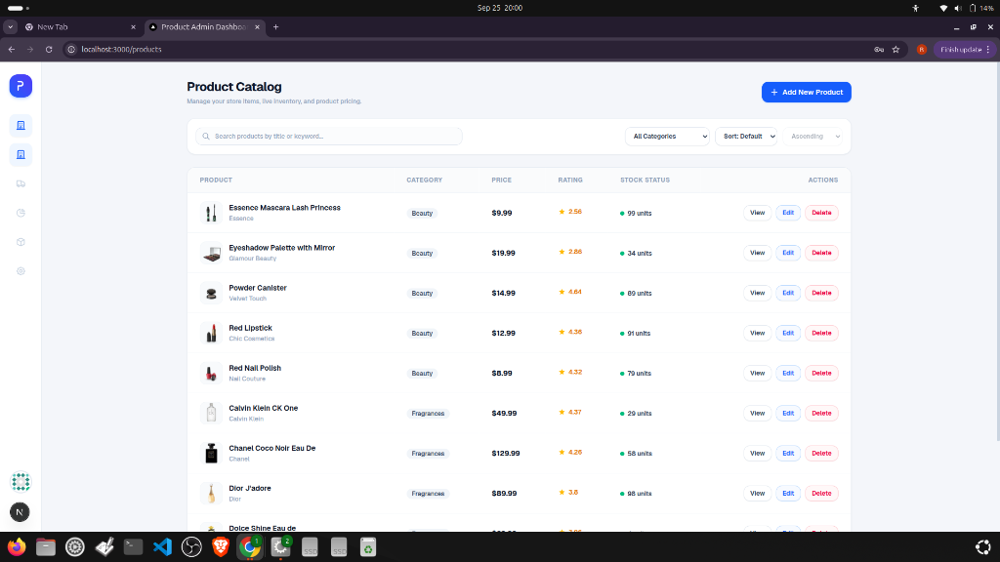

# 🛍️ Product Admin Dashboard

A modern, responsive Product Management Admin Dashboard built with **Next.js 15**, **TypeScript**, and **Tailwind CSS**, connected to the [DummyJSON API](https://dummyjson.com).

[](https://nextjs.org/)
[](https://www.typescriptlang.org/)
[](https://tailwindcss.com/)
[](https://task-three-xi-54.vercel.app)
[](https://opensource.org/licenses/MIT)

🔗 **Live Demo:** [https://task-three-xi-54.vercel.app](https://task-three-xi-54.vercel.app)  
📂 **GitHub Repo:** [https://github.com/NiranjanKumar001/Product-Admin-Dashboard](https://github.com/NiranjanKumar001/Product-Admin-Dashboard)

---

## 📸 Preview



---

## 🌟 Key Features

- **🔐 Authentication & Route Protection**: Mock login using DummyJSON auth with automatic session persistence and route protection.
- **📱 Responsive Layout**: Modern data table for desktop and clean, mobile-optimized product cards on smaller screens.
- **⚡ Fast Live Search & Debouncing**: Instant search with a 400ms debounce and automatic cancellation of stale network requests.
- **🏷️ Category Filtering & Sorting**: Filter items across all categories and sort by Price, Rating, or Title (Ascending/Descending).
- **🔗 Synced URL State**: Search terms, active categories, sort preferences, and page numbers are preserved directly in the URL query string.
- **📦 Full CRUD Operations**: Create new products, edit existing items, and delete with interactive confirmation modals.
- **🔍 Detailed Product View**: Gallery with thumbnail switching, pricing, discount badges, inventory status, and user reviews.
- **🔄 Resilient Network Handling**: Friendly empty states, clear loading spinners, and instant **Retry** buttons on network failures.

---

## 🔑 Test Login Credentials

Use the following mock credentials to log in:

| Field | Value |
| :--- | :--- |
| **Username** | `emilys` |
| **Password** | `emilyspass` |

---

## 🚀 Getting Started

### 1. Clone the repository
```bash
git clone https://github.com/NiranjanKumar001/Product-Admin-Dashboard.git
cd Product-Admin-Dashboard
```

### 2. Install dependencies
```bash
npm install
```

### 3. Start development server
```bash
npm run dev
```

Visit [http://localhost:3000](http://localhost:3000) to view the dashboard.

### 4. Build for production
```bash
npm run build
npm run start
```

---

## 📄 License
This project is open-source and available under the [MIT License](LICENSE).
